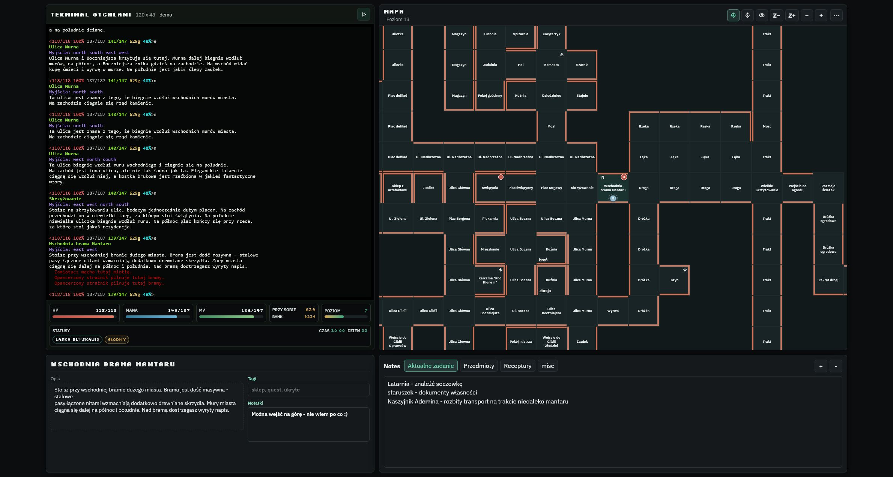
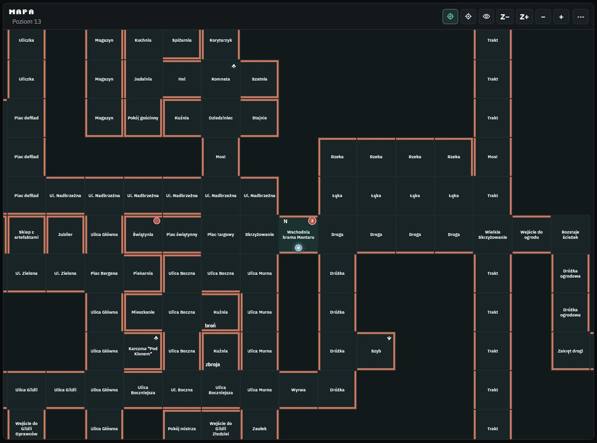
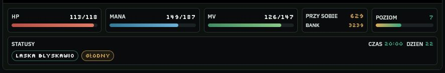
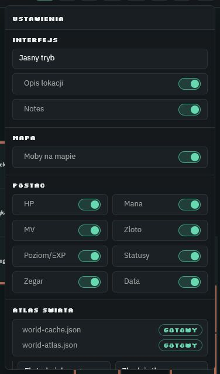

# Funkcjonalności Otchlan Mapper

Ten plik opisuje funkcje aplikacji z perspektywy użytkownika. README zostaje przewodnikiem instalacji i uruchomienia, a tutaj jest pełniejsza lista tego, co aplikacja potrafi.

## Prezentacja interfejsu

### Główny widok

Terminal gry, mapa, informacje o aktualnej lokacji, notatki oraz panel statystyk są dostępne w jednym widoku.

### Mapa i warstwa mobów

Mapa pokazuje aktualną pozycję gracza, odkryte lokacje, przejścia, poziom `z` oraz widoczne moby.

### Statystyki postaci

Panel pod terminalem pokazuje HP, manę, MV, złoto, poziom postaci, czas gry oraz aktywne statusy.

### Ustawienia aplikacji

Ustawienia pozwalają ukrywać elementy interfejsu i zarządzać atlasem oraz backupami.

## Terminal i gra

- Uruchamianie i zatrzymywanie Otchlani z poziomu interfejsu.
- Terminal gry w przeglądarce oparty o xterm.js.
- Stały rozmiar terminala `120 x 48`.
- Przekazywanie inputu użytkownika do gry bez interpretowania komend jako źródła prawdy dla mappera.
- Claim aktywności mappera po powrocie do karty, focusie okna i kliknięciu terminala.
- Opcjonalne nagrywanie outputu terminala w trybie debug.

## Mapa i nawigacja

- Renderowanie mapy pokoi, wyjść, ścian, przejść specjalnych, korytarzy i poziomów `z`.
- Pozycja gracza synchronizowana z pamięci procesu `otchlan.exe`.
- Brak zgadywania pozycji z tekstu terminala i brak przechwytywania komend gracza jako mechanizmu ruchu mapy.
- Automatyczne odkrywanie odwiedzonych pokoi.
- Inferowanie lokalnych połączeń między sąsiednimi pokojami na podstawie pamięci i atlasu.
- Śledzenie gracza na mapie z możliwością włączenia lub wyłączenia.
- Płynna animacja pionka gracza przy ruchu.
- Animowane przesuwanie widoku mapy przy śledzeniu gracza.
- Crossfade przy zmianie poziomu `z`.
- Tryb debug / cała mapa pokazujący większy zakres atlasu.
- Renderowanie tylko widocznych pokoi w trybie całej mapy, żeby ograniczyć koszt rysowania.

## Dane z pamięci gry

- Szybki czytnik pamięci w C# (`OtchlanMemoryReader`).
- Fallback PowerShell, gdy szybki czytnik nie jest zbudowany.
- Odczyt pozycji, krainy, współrzędnych i poziomu `z`.
- Odczyt HP, many i MV.
- Odczyt poziomu postaci oraz postępu EXP do kolejnego poziomu.
- Odczyt złota przy postaci i złota w banku.
- Odczyt czasu gry i dnia podróży.
- Odczyt aktywnych czarów i statusów postaci.
- Wykrywanie ciemności jako stanu ograniczającego widoczność mobów.
- Oddzielne interwały odczytu pozycji/statystyk i mobów.

## Statystyki postaci w UI

- Panel statystyk pod terminalem.
- Wizualizacja HP, many i MV jako paski.
- Złoto przy postaci i złoto w banku w jednym polu.
- Poziom postaci oraz pasek postępu EXP.
- Statusy i aktywne efekty w formie małych etykiet.
- Czas gry i dzień podróży obok statusów.
- Animowane popupy zmian statystyk, np. `-7 HP` albo `+20` złota.
- Ustawienia widoczności dla: HP, mana, MV, złoto, poziom/EXP, statusy, zegar i data.

## Moby na mapie

- Warstwa mobów czytana z pamięci gry, nie z terminala.
- Nazwy mobów mapowane z danych gry.
- Questowe NPC mogą mieć nazwy z pamięci `MOBQ`.
- Normalny widok pokazuje moby widoczne dla gracza w czterech kierunkach.
- Ściany blokują widzenie mobów.
- Tryb debug / cała mapa może pokazać wszystkie znane moby z aktualnego poziomu.
- Kilka mobów na jednym polu jest agregowane w jeden marker z licznikiem i tooltipem.
- Moby są ukrywane, gdy postać nie może się rozejrzeć, np. w ciemności bez źródła światła.
- Widoczność mobów na mapie można włączyć albo wyłączyć w ustawieniach.

## Notatki i warstwa użytkownika

- Notatki przypisane do lokacji.
- Tagi lokacji.
- Globalny notes z wieloma stronami.
- Edycja notatek i tagów także dla wybranych pokoi, nie tylko pola gracza.
- Możliwość ukrycia panelu notesu w ustawieniach.
- Możliwość ukrycia opisu lokacji w ustawieniach.
- Warstwa użytkownika obejmuje odwiedzone lokacje, notatki, tagi i globalny notes.
- Pozycja gracza nie jest zapisywana jako część backupu warstwy użytkownika.

## Zapis, backup i bezpieczeństwo danych

- Serwerowy zapis warstwy użytkownika do `user-layer.json`.
- Automatyczny zapis zmian warstwy użytkownika.
- Oszczędny zapis pozycji runtime, bez przepisywania całej warstwy, gdy nie trzeba.
- Import backupu JSON.
- Eksport backupu JSON.
- Popupy informujące o imporcie, eksporcie, błędach serwera i wybranych akcjach UI.
- Ostrzeżenie i modal potwierdzenia przed akcją `Nowa mapa`.
- Rotowane logi aplikacji i serwera.

## Ustawienia interfejsu

- Pełny panel ustawień pod przyciskiem menu mapy.
- Sekcje ustawień: Interfejs, Mapa, Postać, Dane i Debug.
- Przełącznik jasnego / ciemnego motywu.
- Przełącznik opisu lokacji.
- Przełącznik panelu notesu.
- Przełącznik mobów na mapie.
- Przełączniki poszczególnych statystyk postaci.
- Import i eksport backupu z sekcji Dane.
- Akcja `Nowa mapa` z wymaganym potwierdzeniem.
- Sekcja Debug widoczna tylko w trybie debug.

## Logi i diagnostyka

- `logs/automapper.log` dla zdarzeń mappera.
- `server.log` dla serwera i nieobsłużonych błędów.
- `logs/terminal-output-debug.jsonl` dla pełnego outputu terminala w trybie debug.
- Rotowanie logów konfigurowane zmiennymi środowiskowymi.
- Diagnostyka odczytu pamięci i stanu procesu gry.
- Smoke test lokalnego serwera.

## Generowanie atlasu

- `npm.cmd run world:extract` czyta dane świata z lokalnej instalacji Otchlani.
- `npm.cmd run world:atlas` buduje atlas dla mappera.
- Domyślna ścieżka gry to `C:\Program Files (x86)\Otchlan 1.3`.
- Możliwość ustawienia innego katalogu gry przez `OTCHLAN_DIR`.
- Wygenerowane pliki `world-cache.json` i `world-atlas.json` są lokalne i ignorowane przez git.

## Testy i jakość

- `npm.cmd run verify` uruchamia kontrolę składni, build czytnika pamięci, testy i smoke test.
- Testy obejmują UI, parsery, atlas, serwer, zapis warstwy użytkownika, odczyt pamięci i zachowania mappera.
- Testy statyczne pilnują ważnych decyzji produktowych, np. braku ręcznego save/load serwera w ustawieniach.
